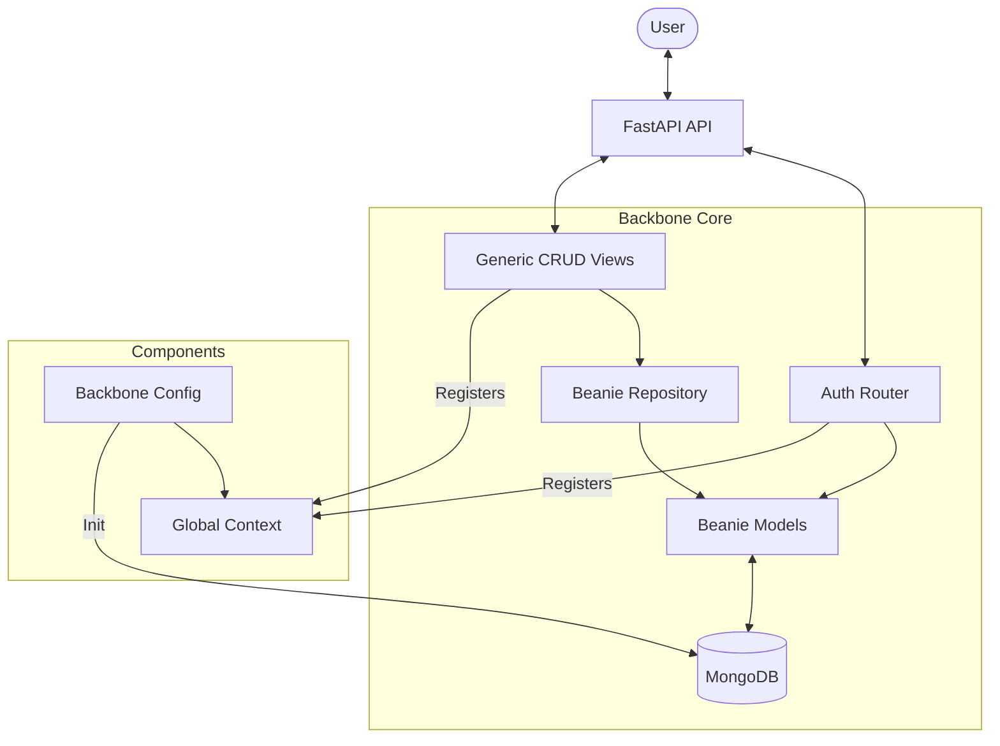

# Modular Backbone Framework (Beanie Edition)

This is a modular FastAPI framework designed for rapid development with MongoDB, using **Beanie** (ODM) for data modeling and **Pydantic** for schemas.

## Architecture

The framework is built around a centralized `BackboneConfig` that handles the application lifecycle, database connections, and component registration.



## Key Concepts

### 1. Beanie Models (Core)
Data is modeled using `beanie.Document`. All models inherit from `AuditDocument` to automatically track creation and update times.

```python
class User(AuditDocument):
    email: EmailStr
    # ...
```

### 2. Generic Repository
The `BeanieRepository` provides a standard interface for CRUD operations, abstracting the underlying Beanie/MongoDB calls. This allows swapping implementations if needed (e.g., to SQLModel).

### 3. Generic Views
`GenericCrud` and related classes (`GenericList`, `GenericCreate`, etc.) typically use standard Pydantic schemas for API Input/Output, but interact with the database via the `BeanieRepository` and `Beanie Models`.

**Flow:**
`API Request` -> `Generic View` -> `Repository` -> `Beanie Document` -> `MongoDB`

## Folder Structure

```
backend/
├── main.py                 # Entry point, Configures Backbone
├── backbone/
│   ├── core/
│   │   ├── database.py     # Beanie Initialization
│   │   ├── models.py       # User, Session, AuditDocument
│   │   └── repository.py   # Generic Beanie Repository
│   ├── auth.py             # Auth Router (Login/Register)
│   ├── config.py           # Lifespan & Settings
│   ├── dependencies.py     # Auth Dependencies (get_current_user)
│   ├── generic.py          # Generic CRUD View Classes
│   ├── interface.py        # Repository Interface
│   ├── permissions.py      # Permission Classes (IsOwner, etc.)
│   ├── schemas.py          # shared Pydantic Schemas (API I/O)
│   └── utils.py            # Password & Token Utilities
└── schema.py               # App-specific Schemas (Blog, Note, etc.)
```

## Setup

1.  **Install Dependencies:**
    ```bash
    uv add fastapi beanie motor pydantic pydantic-settings
    ```

2.  **Run Server:**
    ```bash
    python main.py
    ```

## Extending

To add a new resource (e.g., `Product`):

1.  Create a **Beanie Model** in `models.py` (or a valid location used in `init_database`).
2.  Create **Pydantic Schemas** for API Request/Response.
3.  Instantiate `GenericCrud` in `main.py` (or a router file).

```python
# Model
class Product(AuditDocument):
    name: str
    price: float

# Schema
class ProductSchema(BaseModel):
    name: str
    price: float

# View
product_crud = GenericCrud(
    schema=ProductSchema, 
    # repository=BeanieRepository(Product), # If manual wiring needed
    prefix="/products"
)
app.include_router(product_crud.router)
```
